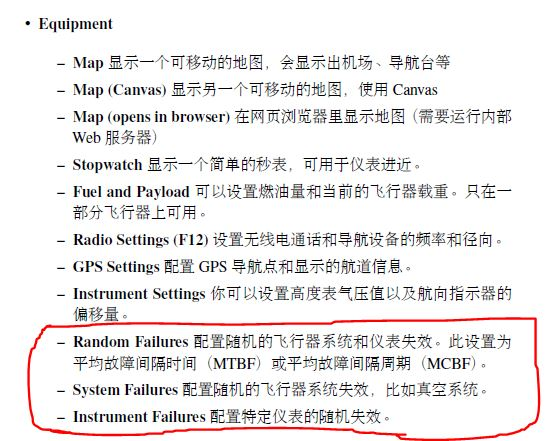

**memo:**


[TOC]

## **FG 可用功能**

- 定位功能


- 随机设备故障




## **PID控制器**（比例-积分-微分[控制器](https://zh.wikipedia.org/wiki/%E6%8E%A7%E5%88%B6%E5%99%A8)）

### 公式

$$
{\mathrm  {u}}(t)={\mathrm  {MV}}(t)=K_{p}{e(t)}+K_{{i}}\int _{{0}}^{{t}}{e(\tau )}\,{d\tau }+K_{{d}}{\frac  {d}{dt}}e(t)
$$

$K_{p}$：比例增益，是调适参数

$K_i$：积分增益，也是调适参数

$k_d$：微分增益，也是调适参数

$e$：误差=设定值（SP）- 回授值（PV）

$t​$：目前时间

$\tau$：积分变数，数值从0到目前时间$t$

### P

- 比例增益过大，变化过大，系统不稳定
- 比例增益较小，不敏感
- 比例增益太小，无法修正干扰的影响

### I

- 考虑过去一段时间的累计误差
- 加速系统趋近设定值
- 消除稳态误差

### D

- 提升时间和系统稳定性


## **Python Learning Note**


### [geographiclib](https://geographiclib.sourceforge.io/html/python/index.html)

1. [dictionary](https://geographiclib.sourceforge.io/html/python/interface.html#geodesic-dictionary)

2. Inverse()

    ```python
    from geographiclib.geodesic import Geodesic
    Geodesic.WGS84.Inverse(-41.32, 174.81, 40.96, -5.50)
    {'lat1': -41.32,
     'a12': 179.6197069334283,
     's12': 19959679.26735382,
     'lat2': 40.96,
     'azi2': 18.825195123248392,
     'azi1': 161.06766998615882, #第二个点相对于第一个点的方位角
     'lon1': 174.81,
     'lon2': -5.5}
    ```


### pandas 

1. `Dataframe`添加一行

    ```python
    df.loc[i] = {'a':1,'b':2}
    df.loc[i] = [1,2]
    ```

2. 归一化

    ```
    df - df.min() / (df.max() - df.min())
    ```

3. 合并

    ```python
    pd.concat(objs, axis=0)
    ```

4. 删除包含`NaN`的列或行

    ```python
    #删除表中全部为NaN的行
    df.dropna(axis=0,how='all') 
    #删除表中含有任何NaN的行
    df.dropna(axis=0,how='any') #drop all rows that have any NaN values
    #改变为axis=1,即可删除列
    ```

5. 替换`NaN`

    ```python
    # 替换NaN为value
    df.fillna(value)
    ```

6. 转置

    ```python
    df.T
    ```

    

 