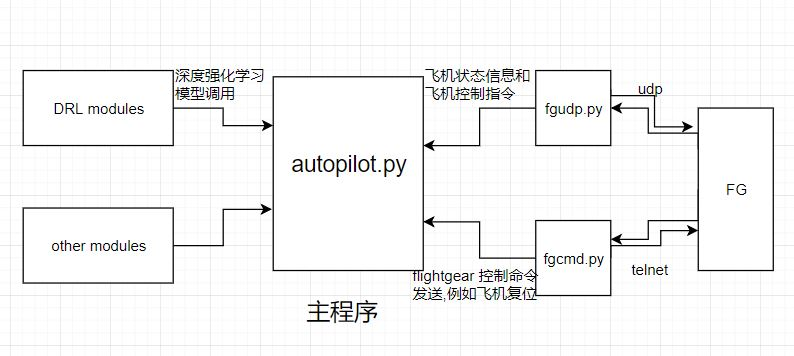

# FG Autopilot

**important:** create folder`data/flylog` in the same directory before you run the code.

## code

- `client.py` 主程序
    - 默认100s后关闭，如需更改，只需更改文件尾`time.sleep(90)`为`input()`,增加主程序休眠时间
    - 程序输入回车结束运行
- `server.py` 模仿flight gear 收发数据，用于代码调试
- `autopilot.py` 所有自动驾驶的控制算法实现的地方
- code structure

## data

- we will save all the fly log in folder `data/flylog`. their named by the time the log created.
- input format
    - input send from flight gear in every 0.1s

## sys

- `takeoff ` 起飞
    - 起飞前
    - **跑道上** 加速与维持方向稳定
    - **离地后** 稳定爬升与维持机身姿态
- `cruise ` 巡航

## terms

- 水平飞行（horizontal flight）
- 定常飞行（steady flight）
- 操作杆转弯