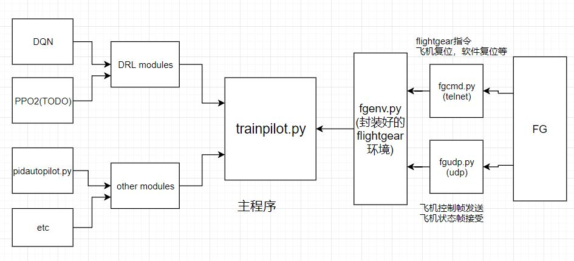

# FG Autopilot

1. 实现了flightgear的python接口,利用flightgear可进行udp,telnet通信的功能,实现了python对FG的控制以及FG信息的获取。(搭建了FG的python环境(类似OpenAI用到的gym环境),便于同时使用 python 和 FlightGear 进行机器学习)
2. 在1的基础上，实现了PID，并应用强化学习以实现自动驾驶

## Environment

- windows 10
- FlightGear 2018.2.2
- python 3.6.7
- conda 4.5.12
- pandas 0.23.4
- numpy 1.14.2
- tensorflow 1.12.0
- [geographiclib](https://geographiclib.sourceforge.io/html/python/index.html) 1.49

## Install

1. Install Anaconda in your compute, you can get it [here](https://www.anaconda.com/download/). you need a python3 version.

2. add  `path\of\your\Anaconda\` and`path\of\you\Anaconda\Scripts` to your system environment

3. run the following command in your Windows PowerShell:

    ```shell
    conda install numpy
    conda install pandas
    conda install tensorflow
    pip install geographiclib
    ```

4. Install FlightGear on your computer, you can get it [here](http://home.flightgear.org/download/) 

5. copy `config/fgudp.xml`into folder `FG_ROOT/data/Protocol`. `FG_ROOT` is the folder where you install FG 

6. start flight gear and  add below command line option into the blank white box in the tail of flightgear setting page. after this , press the `fly` button to begin your fly. 

    ```
    --allow-nasal-from-sockets
    --telnet=5555
    --httpd=5500
    --generic=socket,in,10,127.0.0.1,5701,udp,fgudp
    --generic=socket,out,10,127.0.0.1,5700,udp,fgudp
    ```

7. To begin communicate with flightgear using python. just run the `python example.py`

8. **[tips] next time you only need to start flightgear and do step 7. you don't need to do step 1-6 again**

## Code & Features

- `train.py` 主程序
    - 训练模型主程序，已实现`pid`,`dqn`,`actor-critic`, `DDPG`.
- `data_analysis.py`  用于分析飞行日志(`data/flylog`)，数据分析程序
- `DRL`  强化学习模型
    - `DQN` 
    - `ActorCritic`
    - `DDPG`
    - PPO2 等模型待实现
- `fgmodule` ,FG通信与控制模块
    - `fgudp.py`  flightgear通信主要模块。状态接收和控制帧发送
    - `fgcmd.py`  实现fg远程命令行控制，复位等功能
    - `fgenv.py` 将`fgudp` 和`fgcmd`进行封装, 详细功能见程序内注释
        - `initial()`
        - `step()`
        - `reposition()` 
        - `reset()`
        - `replay()` 另一种飞机复位方式
- `scaffold` 辅助模块
    - `pidpilot.py` , PID自动驾驶控制算法实现
    - `fgdata.py`, 数据格式转换
    - `utils.py`
- `Doc` 一些帮助文档
- `data` we will save all the fly log in folder `data/flylog`. their named by the time when the log created.
- `Framework`: 结构如下



## terms

- `takeoff ` 起飞
    - 起飞前
    - **跑道上** 加速与维持方向稳定
    - **离地后** 稳定爬升与维持机身姿态
- `cruise ` 巡航

- 水平飞行（horizontal flight）
- 定常飞行（steady flight）

## Relative Doc

- `F:\FlightGear 2018.2.2\data\Docs\README.IO`

- [启动时命令行参数简介](http://flightgear.sourceforge.net/getstart-en/getstart-enpa2.html)

- [telnet help](http://wiki.flightgear.org/Telnet_usage#nasal?tdsourcetag=s_pctim_aiomsg) **this is very important for using telnet, please read carefully**

- quick replay
    Load Flight Recorder Tape (Shift-F1) load a pre-recorded flight to play back.
    Save Flight Recorder Tape (Shift-F2) saves the current flight to play back later.
    we can also use (Ctrl-R) to make a quick replay

- some important props 
    ```
    /sim/model/autostart  #设置飞机autostart的值
    /controls/gear/brake-parking #设置飞机停车刹车
    /sim/crashed #设置飞机是否坠毁
    ```

